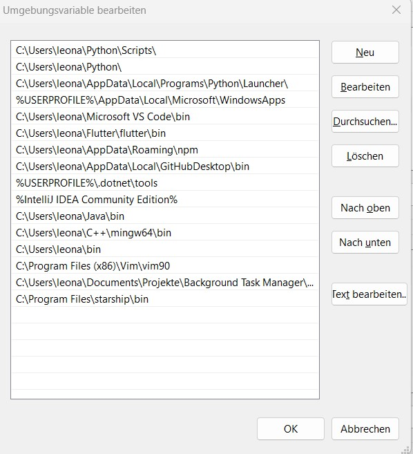

# Project manager

A project manager made with python. It gives the possibility to create, read and delete projects including the folder.
It stores the path in a general index in your home directory.  


## Installation 

```bash
git clone https://github.com/Jolumine/ProjectManager.git
```
### __Add to path on linux__:
**Create folder**
```bash
mkdir bin
```
**Move script the bin folder**
```bash
mv path/to/repo/manager.py ~/bin/
```
**Make python file executable**
```bash
cd ~/bin/
sudo chmod +x manager.py
```
**Open bash settings**
```bash
nano ~/.bashrc
```
**or**
```bash
nano ~/.bash_profile
```
**Write the following line at the end to add the script to the PATH**
```text
export PATH="$PATH:$HOME/bin"
```
**Create alias**
```
alias manager="manager.py"
```
**Refresh**
```bash
source ~/.bashrc
```
**or**
```bash
source ~/.bash_profile
```

### __Add to path on windows__: 

Search for systemvariable in the taskbar

 
Double click this in your system variables.

Path:

```bash
path/to/repo/bin
```


Create a new one and paste the path.


## Usage 

Fill in the information for every command, when they are requesting some. 

### create a new project
```bash
manager -create 
```

### delete a project 
```bash
manager -delete 
```

### list all projects 
```bash
manager -list
```

### show a specific project 
```bash
manager -show [name of your project]
```
